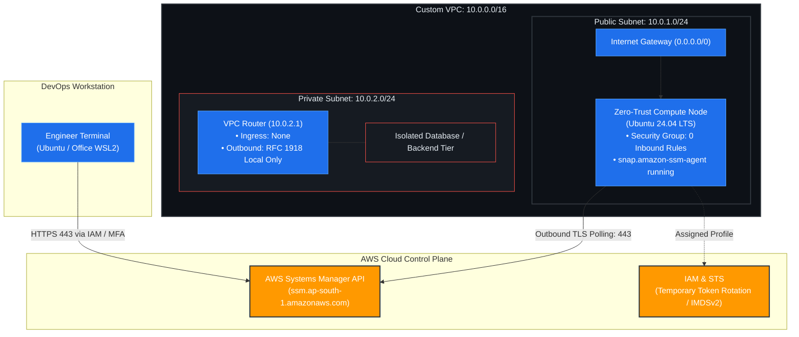

# Enterprise Cloud Infrastructure: Zero-Trust AWS Architecture via Terraform

[](https://www.terraform.io/)
[](https://aws.amazon.com/)
[](#zero-trust-access-model)
[](#remote-state-architecture)
[](https://ubuntu.com/)

An enterprise-grade, automated AWS infrastructure foundation engineered with **Terraform (HCL)** to demonstrate production cloud architecture, defense-in-depth networking, and distributed state governance.

This showcase tracks the architectural evolution from traditional **Bastion Jump Host (Port 22 SSH)** networking to a hardened, **Zero-Trust AWS Systems Manager (SSM) Session Manager** access model featuring **zero open inbound ports** (`IpPermissions: []`).

---

## Table of Contents
1. [Architecture & Topology](#architecture--topology)
2. [Key Engineering Innovations](#key-engineering-innovations)
3. [Zero-Trust Access Model](#zero-trust-access-model)
4. [Remote State Architecture](#remote-state-architecture)
5. [Repository Structure](#repository-structure)
6. [Operational Verification & Security Audits](#operational-verification--security-audits)
7. [Production Edge Cases Diagnosed & Resolved](#production-edge-cases-diagnosed--resolved)
8. [Multi-Workstation Deployment Runbook](#multi-workstation-deployment-runbook)

---
## Architecture Overview


---

## Key Engineering Innovations

| Feature | Legacy Bastion / Jump Host | Enterprise Zero-Trust Implementation |
| :--- | :--- | :--- |
| **Inbound Attack Surface** | Inbound Port 22 exposed to `0.0.0.0/0` | **Zero open inbound ports (`0` ingress rules)** |
| **Public IP Requirement** | Mandatory on Bastion host | **None needed on compute workloads** |
| **Identity & Authentication** | Static SSH key pairs (`~/.ssh/id_rsa`) | **AWS IAM Policies & Temporary STS Tokens** |
| **Credential Management** | Vulnerable to key theft and hardcoding | **Automated token rotation via IMDSv2** |
| **Infrastructure Overhead** | Dedicated jump server costing ~$15/mo | **$0.00 dedicated compute overhead** |
| **Audit Trail & Logging** | Manual syslog forwarders required | **Native AWS CloudWatch & S3 session logging** |

---

## Zero-Trust Access Model

In this deployment, instances do not listen on standard administration ports:

1. **Outbound-Initiated Control Plane:** The pre-installed `amazon-ssm-agent` daemon on Ubuntu 24.04 initializes an outbound TLS (port 443) long-polling tunnel to AWS Systems Manager.
2. **Elimination of SSH Keys:** Access is managed through AWS IAM RBAC. Engineers authenticate via standard IAM credentials (`aws configure` / AWS STS) rather than managing distributed `authorized_keys` files.
3. **IMDSv2 Hardening:** The compute instance enforces **Instance Metadata Service Version 2 (IMDSv2)** with token-based session verification (`PUT` handshake), mitigating SSRF attack vectors.

---

## Remote State Architecture

To facilitate multi-developer workflows without risk of state corruption, local state storage was replaced with a distributed remote backend:

[ Developer A (Home) ]        [ Developer B (Office WSL) ]
│                                 │
└───► [ DynamoDB: Lock Table ] ◄──┘
• Partition Key: LockID
• Prevents Concurrent Execution Race Conditions
│
▼
[ Amazon S3: tfstate Store ]
• Bucket: adyl-tfstate-ap-south-1-*
• Encryption: Server-Side AES-256
• Versioning: Enabled (Full Rollback History)

---

## Repository Structure

```text
.
├── environments/
│   ├── dev/                 # Dev environment composition
│   │   ├── main.tf          # Instantiates modules with dev variables (10.10.0.0/16)
│   │   ├── variables.tf     # Dev parameter definitions
│   │   ├── outputs.tf       # Dev outputs & SSM command
│   │   └── provider.tf      # Isolated remote state: showcase/dev/terraform.tfstate
│   └── prod/                # Prod environment composition
│       ├── main.tf          # Instantiates modules with prod variables (10.0.0.0/16)
│       ├── variables.tf     # Prod parameter definitions
│       ├── outputs.tf       # Prod outputs & SSM command
│       └── provider.tf      # Isolated remote state: showcase/prod/terraform.tfstate
├── modules/
│   ├── networking/          # Reusable VPC, Subnets, IGW, Route Tables
│   │   ├── main.tf
│   │   ├── variables.tf
│   │   └── outputs.tf
│   └── compute/             # Reusable Zero-Trust EC2, IAM, Security Groups
│       ├── main.tf
│       ├── variables.tf
│       └── outputs.tf
└── README.md                # Comprehensive documentation & architectural runbook
```


## Operational Verification & Security Audits

1. Inbound Firewall Audit (Confirming Zero Open Ports)
Execute an AWS CLI inspection directly against the active security group:

aws ec2 describe-security-groups \
  --group-ids $(terraform output -raw zero_trust_security_group_id) \
  --query "SecurityGroups[0].IpPermissions"

2. Zero-Trust Interactive Terminal Connection
Establish a secure, authenticated shell without private keys or public IPs:

$(terraform output -raw ssm_start_session_command)

3. Instance Metadata Service v2 (IMDSv2) Audit
Inside the active shell session, verify token-based IAM role authentication:

## Step A: Request a secure 6-hour IMDSv2 token
TOKEN=$(curl -s -X PUT "[http://169.254.169.254/latest/api/token](http://169.254.169.254/latest/api/token)" -H "X-aws-ec2-metadata-token-ttl-seconds: 21600")

## Step B: Interrogate assigned IAM Instance Profile
curl -s -H "X-aws-ec2-metadata-token: $TOKEN" [http://169.254.169.254/latest/meta-data/iam/security-credentials/](http://169.254.169.254/latest/meta-data/iam/security-credentials/)

## Step C: Inspect temporary STS session credentials
curl -s -H "X-aws-ec2-metadata-token: $TOKEN" [http://169.254.169.254/latest/meta-data/iam/security-credentials/production-ssm-ec2-role](http://169.254.169.254/latest/meta-data/iam/security-credentials/production-ssm-ec2-role)


## Production Edge Cases Diagnosed & Resolved
During development and load testing, three enterprise cloud engineering challenges were diagnosed and resolved:

### 1. Security Group Dependency Deadlock
Root Cause: Attempting an in-place modification of security groups triggered an AWS API DependencyViolation. AWS forbids deleting a security group while active Elastic Network Interfaces (ENIs) are attached.

Remediation: Configured lifecycle { create_before_destroy = true } paired with name_prefix in Terraform. This ensures new security groups are provisioned and swapped before legacy groups are terminated.

### 2. AWS Elastic IP Disassociation Race Condition
Root Cause: Simultaneous deletion of a NAT Gateway and its associated Elastic IP (EIP) triggered InvalidNetworkInterfaceID.NotFound. AWS background detach operations ran asynchronously with Terraform's release API call.

Remediation: Structured explicit resource dependency chains (depends_on = [aws_internet_gateway.gw]) and introduced managed state convergence patterns.

### 3. Multi-Workstation SSH Key Registration Pitfall
Root Cause: aws_key_pair was updated in code across different machines, but running EC2 instances failed authentication. Key pairs injected via cloud-init only write to ~/.ssh/authorized_keys during the initial boot cycle.

Remediation: Executed targeted resource recreation via terraform apply -replace to enforce clean bootstrapping, before permanently deprecating SSH in favor of SSM Session Manager.

### Deployment Instructions

Navigate to the target environment directory:

```bash
# For Development Environment
cd environments/dev

# For Production Environment
cd environments/prod

# Initialize remote backend and download provider plugins
terraform init

# Validate configuration syntax
terraform validate

# Review the execution plan
terraform plan

# Provision infrastructure
terraform apply -auto-approve

# Connect via Zero-Trust SSM Session Manager
$(terraform output -raw ssm_connect_command)

# Teardown infrastructure (Prevent idle costs)
terraform destroy -auto-approve


Prerequisites
AWS CLI v2 configured with administrative IAM credentials
AWS Session Manager Plugin installed loca
```

### Git Multi-Workstation Synchronization Protocol

```bash
# When finishing on Workstation A:
git add .
git commit -m "feat(ssm): verify zero-trust session manager implementation"
git push origin main

# When picking up on Workstation B:
git pull origin main
terraform init   # Refreshes remote state lock against DynamoDB
---
```

